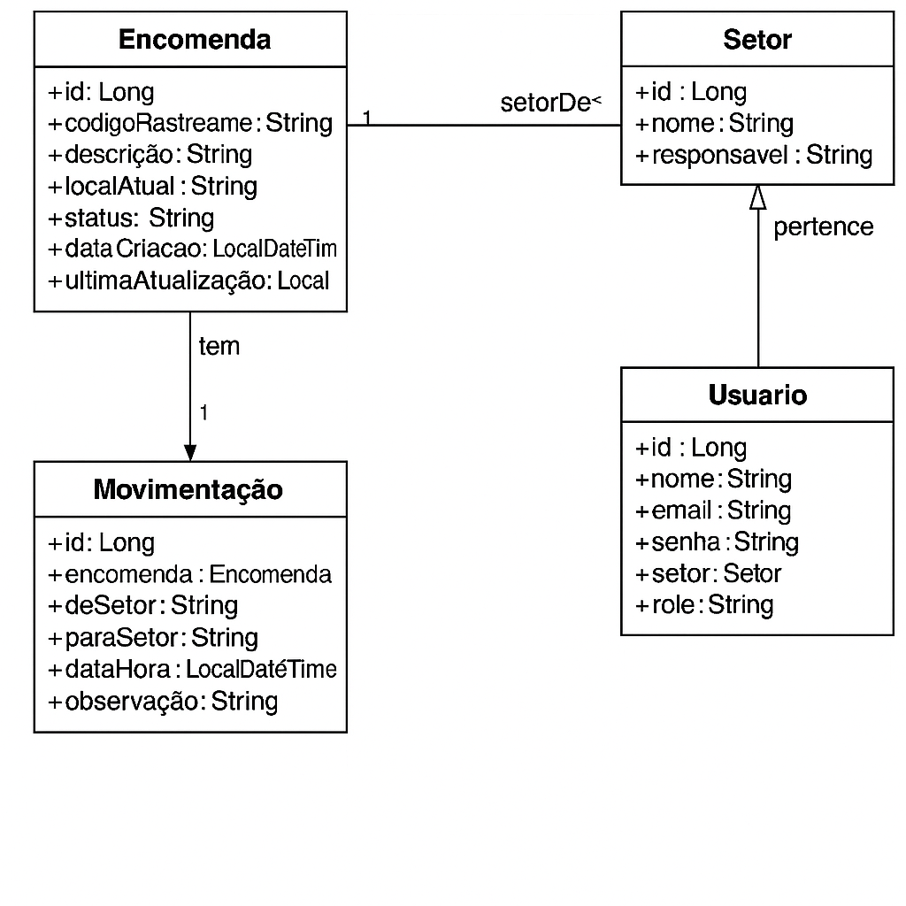

# 📦 TrackAPI

TrackAPI é uma API REST desenvolvida em Java com Spring Boot para gerenciar o rastreamento de encomendas internas em uma organização. Ela permite registrar, atualizar e consultar o status de entregas entre setores da empresa de forma simples e eficiente.

---

## 🚀 Tecnologias Utilizadas

- Java 21
- Spring Boot
- Spring Web
- Spring Data JPA
- H2 Database / PostgreSQL / MySQL
- Lombok
- Bean Validation (Jakarta Validation)

---

## 📌 Funcionalidades

- ✅ Cadastro de encomendas
- ✅ Atualização de status e localização
- ✅ Registro e histórico de movimentações
- ✅ Listagem e filtro por setor, status e data
- ✅ Cadastro e listagem de setores
- ✅ Cadastro de usuários por setor (futuramente com autenticação)

---

## 📊 Diagrama de Classes

O diagrama abaixo representa a estrutura das classes principais da **TrackAPI**:



---

## 📁 Estrutura de Diretórios

```text
│
├── com.trackapi
│   ├── controller
│   │   ├── dto
│   │   └── exception
│   │
│   ├── domain
│   │   ├── model
│   │   └── repository
│   │
│   ├── service
│   │   ├── exception
│   │   └── impl
│   │
│   └── Application.java
│
└── resources
    ├── application-dev.yml
    └── application-prd.yml